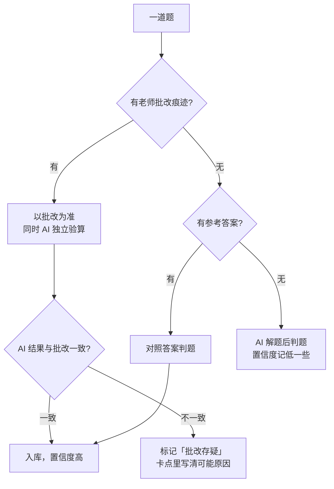
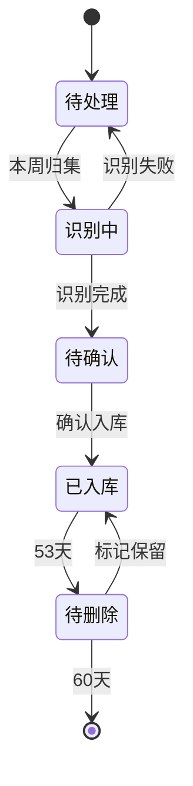

# 数学 AI 教陪助手 产品需求文档（PRD）

| 项目 | 内容 |
|:--|:--|
| 文档版本 | v1.7 |
| 创建日期 | 2026-09-06 |
| 状态 | 首版实现完成（见第 10 节），试运行中 |
| 部署形态 | 家用电脑本地运行 + 家庭内网页面 |
| 教材版本 | 苏教版 小学数学 三年级上册（2024 新版） |

## 0. 变更记录

| 版本 | 日期 | 修改内容 | 原因 |
|:--|:--|:--|:--|
| v1.0 | 2026-09-06 | 初版，整合产品脑图、两轮评审意见、首批扫描件观察 | 立项 |
| v1.1 | 2026-09-06 | 精简文件夹结构：错题按周单文件、知识点单文件、练习并入辅导单、去掉回收站与参考答案目录 | 家长要求文件数量尽量少 |
| v1.2 | 2026-09-06 | 对齐首版实现：错题 md 增加材料表与引导字段、预处理保留彩色、验算改为程序比对算式；新增第 10 节实现状态 | 首版代码完成 |
| v1.3 | 2026-09-06 | 5.3 增加订正规则，错题记录增加订正字段；无凭据时拒绝导入而非 mock | 学校要求当场订正 |
| v1.4 | 2026-09-06 | 归集改为本地命令，页面去掉导入按钮；本周页支持回看往期与按周下载辅导单 | 家长明确每周本地处理，其他家长只需查看导出 |
| v1.5 | 2026-09-06 | 识别与出题改由 Claude Code `/weekly` skill 完成，去掉 API 依赖；练习存入周 md | 家长不用 API key |
| v1.6 | 2026-09-06 | 去掉人工确认环节；算式改用普通符号不用 LaTeX；预习模块从 V2 提前到 V1，练习卷含预习题 | 家长要求简化流程、界面更易读、辅导单要有习题 |
| v1.7 | 2026-09-06 | 练习卷去掉提示只留题目；进度页支持四个维度并可下钻到错题；错题记录做题日期，支持按知识点筛选排序；知识点可按最近学习排序 | 家长要求更好查阅 |

---

## 1. 背景与目标

### 1.1 背景

家长辅导三年级孩子数学时，孩子常因粗心、漏题、概念不清、分心等原因在简单题上丢分，在不必要的题上耗时，大题没有思路。家长缺少一个持续、省力的方式来掌握"这周到底哪里出了问题、比上周有没有好转"。

### 1.2 产品目标

1. **看得见问题**：每周把作业、试卷、教辅里的错题自动归集，按知识点和错因分类。
2. **看得见变化**：同一类问题在后续几周的作业里是否还在出现，用数据说话，形成长期跟踪。
3. **拿得出行动**：每周末生成一页可打印的辅导单，家长照着讲、孩子照着练。

### 1.3 成功指标（V1 试运行 4 周后评估）

| 指标 | 目标 |
|:--|:--|
| 每周家长操作时间（扫描 + 确认） | 15 分钟以内 |
| 错题识别准确率（家长翻错题本时认为判错的比例） | 20% 以下 |
| 知识点归类准确率 | 90% 以上 |
| 每周 AI 调用成本 | 有预算上限，超出时降级处理（见 8.2） |

---

## 2. 用户与使用节奏

### 2.1 角色

| 角色 | 使用方式 | 权限 |
|:--|:--|:--|
| 主辅导家长 | 扫描上传、点击归集、人工确认、打印辅导单 | 全部 |
| 其他家庭成员 | 通过网页查看进度和辅导单 | 只读 |
| 孩子 | 不直接使用系统，只接触打印出来的练习和辅导单 | 无 |

### 2.2 每周节奏


闭环不依赖重新上传练习结果。孩子下周的日常作业扫描进来后，系统自动比对同一知识点、同一错因是否再次出现，据此计算改进进度。

---

## 3. 范围

### 3.1 V1 范围（本文档主体）

- 文件接入、重命名、归档、到期清理
- 扫描件识别与错题提取
- 判题、错因标注、知识点归类
- 错题库与周度进度跟踪
- 知识点清单（预置大纲 + 课外扩展）
- 下周预习（知识点 + 练习）
- 本周辅导单 PDF
- 错题与预习练习生成
- 家庭内网只读页面 + 简单密码

### 3.2 V2 及以后

- 考试卷专项分析（按考试权重）
- 多孩子支持

### 3.3 明确不做

- 孩子在屏幕上答题
- 公网部署、账号体系、找回密码等
- 保存整张扫描原件超过保留期

---

## 4. 总体流程与文件夹结构

### 4.1 文件夹

设计原则：文件数量最少。每周固定只新增 **1 个错题 md + 1 个辅导单 PDF + 若干错题截图**，其余全是单文件。

```
数学 AI 教陪/
├── PRD.md
├── inbox/                        # 家长只往这里放文件，处理完自动清空
├── 原件/                         # 已重命名的扫描原件，60 天后自动删除
│   ├── 2026-W37_学校课时练_第1课时.pdf
│   ├── 2026-W37_学霸_p2-4.pdf
│   └── 参考答案_学霸.pdf           # 答案页也从 inbox 进来，识别后长期保留
├── 错题/
│   ├── 2026-W37.md               # 本周全部错题，一个文件
│   └── 2026-W37/                 # 本周错题截图，每题一张 png
│       └── 003.png
├── 知识点.md                     # 大纲 + 全部知识点节点，单文件，按单元分章
└── 辅导单/
    └── 2026-W37.pdf              # 概览 + 讲解 + 练习 + 答案，一个 PDF
```

说明：

- 原脑图中的三个分类文件夹（习题试卷、书本、预习）合并为一个 `inbox`，由系统按内容识别材料类型。原因：首批扫描件已出现一个 PDF 混合五种来源的情况，靠家长手工分类不可靠。
- 不设回收站、练习、参考答案、大纲等独立目录。练习和答案并入辅导单 PDF；答案页作为一种材料类型进入 `原件/` 并豁免到期删除；大纲是 `知识点.md` 的目录章节。
- 进度数据不单独存文件，页面每次从 `错题/*.md` 重新聚合。
- 一个学期结束时的文件总量预期：错题 md 约 20 个、辅导单 PDF 约 20 个、截图数百张、其余单文件。

### 4.2 材料类型

| 类型 | 判定依据 | 处理方式 |
|:--|:--|:--|
| 课本页 | 页面版式、页码、"想想做做/练习 N" | 进知识点清单，不判题 |
| 预习 | 家长说明是下周内容，或课本单元跑在课堂进度前面 | 同课本页，并记入本周预习清单 |
| 学校练习 | 页眉有"第 N 课时 / 周末练习"、班级姓名栏 | 判题，权重高 |
| 教辅 | 页眉品牌（学霸、补充习题、计算能手等） | 判题，权重中 |
| 试卷 | "测试 / 期中 / 期末"、总分栏 | 判题，权重最高（V2 专项分析） |
| 目录 / 大纲 | 标题"目录" | 校对 `知识点.md` 的目录章节 |
| 参考答案 | 页眉"参考答案 / 答案"，密集算式无手写 | 存入 `原件/`，长期保留，供判题对照 |
| 未知 | 其他 | 按普通习题处理，并在卡点里注明来源不明 |

---

## 5. 功能需求

### 5.1 文件接入与归档

| 编号 | 规则 |
|:--|:--|
| F1-1 | 当 `inbox` 出现新文件（jpg / png / pdf / heic）时，系统应记录上传时间，作为该材料的"做题时间"近似值，归入对应 ISO 周。 |
| F1-2 | 当一个 PDF 内检测到多个来源（页眉品牌或标题变化）时，系统应按来源拆分为多份记录，原 PDF 保留一份。 |
| F1-3 | 重命名格式为 `周_材料类型_简述`，如 `2026-W37_学霸_p2-4`。周取上传日期所在 ISO 周。参考答案命名为 `参考答案_教辅名`。 |
| F1-4 | 同一页重复扫描（感知哈希相似度高）时，系统应只保留清晰度更高的一份，并在确认页提示。 |
| F1-5 | 归集完成后原件移入 `原件/`，`inbox` 清空。原件 60 天后自动删除（参考答案除外）。删除前在页面显示一周预告，家长可标记"保留"。截图与 md 永久保留。 |
| F1-6 | 首次上传的这批材料标记为"起点批次"，不参与"较上周变化"的计算，只作为基线。 |

### 5.2 识别与提取

| 编号 | 规则 |
|:--|:--|
| F2-1 | 识别由 Claude Code 的 `/weekly` skill 完成：程序先把 inbox 文件渲染成逐页图片（`npm run ingest prepare`），Claude 逐页看图按规则库输出 pages.json，程序再判题、裁图、落库（`npm run ingest apply`）。不接任何 API key，不跑本地 OCR。 |
| F2-2 | 送模型前统一预处理：按 EXIF 摆正、缩放到长边 1600px 以内、JPEG 压缩。保留彩色，因为红笔批改痕迹是判题依据。 |
| F2-3 | 竖式区域必须整块送视觉大模型识别，不得依赖 OCR 文本。原因：孩子写的进位小字会让 OCR 把 `709×5` 读成 `709×45`。 |
| F2-4 | 页眉的班级、姓名、学号区域不进入任何截图和模型输入。 |
| F2-8 | 算式一律用 × ÷ 等普通符号写成人能直接读的形式，不使用 LaTeX。程序在存盘前统一清洗一遍。 |
| F2-5 | 识别批改痕迹：红勾、红叉、红圈、订正字迹、右下角等级与分数（如 `B 9.2`）。等级分数存入该份材料的记录。 |
| F2-6 | 错题截图范围为整道题（题干 + 孩子全部过程 + 批改痕迹），不只截错误局部。 |
| F2-7 | `原件/` 中若存在对应教辅的参考答案，识别时优先用答案页对照，减少模型解题。答案页只在首次入库时识别一次，结果缓存在应用数据目录，不在项目文件夹里产生新文件。 |

### 5.3 判题与错因标注

判题来源优先级：



首批扫描件里已出现老师把正确答案打叉的情况（如 `7×16=112`、`4600米−600米=4千米`），因此 AI 独立验算与"批改冲突"标记是必需项。

**订正规则**：学校要求孩子拿到批改后立即订正，所以打叉的题旁边常有重新写的正确答案。识别时要区分"最初答案"与"订正答案"：判题和错因针对最初答案；有订正痕迹的打叉题不算批改冲突；只有打叉、最初答案正确、又没有订正痕迹时才进入冲突确认。订正答案单独记录，供辅导时对照。

错因标签（每道错题必选一个主标签，可选一个副标签）：

| 标签 | 含义 | 首批样本 | 补救方向 |
|:--|:--|:--|:--|
| 计算失误 | 方法对，算错 | `54+12` 写成 61 | 检查习惯，口算专项 |
| 审题 | 条件或问题看错 | "第 9 天"算成加 9 次；"最多/不够分"理解错 | 圈关键词训练 |
| 概念不清 | 方法本身错 | 运算顺序错、单位换算方向反 | 讲解 + 变式练习 |
| 格式规范 | 结果对但漏单位、漏答句、书写不规范 | 答句缺单位被圈 | 提醒清单 |
| 漏题 | 未作答 | 周末练习整题空白 | 检查习惯 |
| 策略缺失 | 大题没思路 | 找规律题空白 | 解题策略示范 |

**没有人工确认环节**：Claude 的判断直接入库，所以每道题都要认真判。老师批改与 AI 验算不一致又没有订正痕迹时，照实记为「批改存疑」，并在卡点里写清楚可能的原因，家长在错题本和辅导单里能看到。

知识点归类：每道题匹配到 `知识点.md` 中的一个课时级节点。大纲外的题（课外班内容）匹配到"课外拓展"分组下的自定义节点，由 AI 建议节点名，家长在确认页可改。

### 5.5 错题库与进度跟踪

每周一个 `错题/周.md`，开头三张表（本周材料、各知识点题量、错题汇总），之后每道错题一个三级小节。结构固定，便于程序解析和人工阅读：

````markdown
# 2026-W37 错题

## 本周材料
| 文件 | 类型 | 来源 | 页数 | 题数 | 等级 | 所属周 |
|:--|:--|:--|:--|:--|:--|:--|
| 2026-W37_学校练习_第2课时.pdf | 学校练习 | 学校课时练 第2课时 | 1 | 7 | B 9.2 | 2026-W37 |

## 各知识点题量
| 知识点 | 题数 |
|:--|:--|
| 01.2 | 7 |

## 错题
| 编号 | 来源 | 知识点 | 错因 | 判题依据 | 已确认 |
|:--|:--|:--|:--|:--|:--|
| 003 | 学校课时练 第2课时 | 01.2 | 计算失误 | 老师 | 是 |

### 003


```yaml
source_type: 学校练习
...
```

**题目** ...
**孩子答案** ...
**订正** 订正后写的答案，没有则留空
**正确答案** ...
**卡点** 一两句
**引导** 家长可以这样问的一句话
````

每题的 yaml 字段：

```yaml
id: 003                     # 周内编号
week: 2026-W37
source_type: 学校练习        # 见 4.2
source_name: 第2课时 除法与加减法的混合运算
source_weight: 3            # 学校练习 3 / 教辅 2 / 试卷 5
knowledge_point: 01.2       # 大纲节点编号
error_type: 计算失误
error_type_secondary: 格式规范
graded_by: 老师 | 参考答案 | AI
grade_conflict: false
teacher_score: B 9.2        # 该份材料整体等级
verdict: wrong              # 最终判定
ai_verdict: correct         # AI 独立验算
teacher_mark: wrong         # 红笔痕迹
confidence: 50
ahead: false                # 超前内容
file: 2026-W37_学校练习_第2课时.pdf
```

做对的题不单独记录，只计入"各知识点题量"表，作为错误率的分母。

进度计算规则：

| 编号 | 规则 |
|:--|:--|
| F5-1 | 进度维度为 `知识点 × 错因`，按周聚合：该周该组合的错题数、该周该知识点总题数（含做对的）、错误率。来源权重（试卷 > 学校练习 > 教辅）用于重点问题排序，不改变错误率本身。 |
| F5-2 | 一个组合连续两周错误率低于阈值（默认 10%）且本周有该知识点的题目出现，标记为"已改善"；连续两周无该知识点题目出现，标记为"未验证"，不算改善。 |
| F5-3 | 起点批次只建立基线，不产生"较上周"对比。 |
| F5-4 | 页面上可按知识点、错因、单元、来源四个维度看同一批错题，时间范围可选本周 / 近四周 / 全部。 |
| F5-5 | 材料进度与课堂进度不符时（如开学第一周出现第四单元内容），按题目内容归类，并打"超前"标记，不计入本周主要问题。 |

### 5.6 知识点清单

| 编号 | 规则 |
|:--|:--|
| F6-1 | 预置苏教版三上大纲（见附录 A），单元 → 课时两级，作为归类骨架。综合实践单元（一天的时间、曹冲称象、了解你的好朋友、间隔排列）也作为节点。 |
| F6-2 | "课外拓展"为独立分组，节点由课外班材料驱动新增。 |
| F6-3 | 全部知识点在 `知识点.md` 一个文件内。一级标题为单元，二级标题为课时节点，节点下固定四段：核心内容（公式或方法，KaTeX）、典型例题（文本，不存截图）、引导方式建议、常见错因。"当前错误情况"不写入文件，由页面从错题 md 实时汇总。 |
| F6-4 | 页面默认只展示核心内容，其余折叠。 |
| F6-5 | 新上传课本页时，AI 提取内容更新到对应节点。家长手工修改过的段落在段首标 `<!-- manual -->`，AI 不覆盖。 |
| F6-6 | 文件开头为目录章节（附录 A 的表），是归类骨架，节点编号一经使用不再更改。 |

### 5.7 本周辅导单（PDF）

每周归集确认后自动生成，A4 一到两页，内容与顺序固定：

1. **本周概览**：材料份数、题目总数、错题数、老师等级分数、较上周变化（起点周除外）。
2. **重点问题 Top 3**：每项包含知识点、错因、代表性错题截图一张、卡点一句话、建议怎么讲（3 到 5 句）、预计用时。
3. **持续跟踪项**：上周重点问题本周的表现，改善 / 未改善 / 未验证。
4. **下周预习**：每个预习知识点的要点、例子、怎么讲、容易错。
5. **课外与超前**：本周出现的大纲外或超前内容，一句话说明。
6. **练习卷附页**：见 5.8，独立分页，带姓名和用时栏，方便只打印给孩子。
7. **答案页**：练习答案、算式和讲解提示，单独一页给家长。

### 5.8 错题练习生成

| 编号 | 规则 |
|:--|:--|
| F8-1 | 对 Top 3 每个重点问题和每个下周预习知识点各生成一组练习：计算类 5 题、应用题类 3 题。练习卷上只有题目，讲解提示印在答案页给家长看。 |
| F8-2 | 梯度：2 题同构、2 题略变、1 题综合（应用题为 1/1/1）。 |
| F8-3 | 数值范围遵守三年级上限制：整数、万以内、不出现负数、除法为整除或课内已学的有余数。 |
| F8-4 | 所有答案必须经程序验算（模型同时给出算式，程序计算后与答案比对），验算不通过的题丢弃。 |
| F8-5 | 错因为"审题"的练习，题干应包含干扰条件或"最多/最少/一共/还剩"类关键词。 |
| F8-6 | 错因为"计算失误"的练习，附一行"检查提示"（如：先估算结果的位数）。 |

### 5.9 家庭内网页面

| 页面 | 内容 | 权限 |
|:--|:--|:--|
| 登录 | 单一家庭密码 | 全部 |
| 本周 | 本周概览、重点问题、下周预习，前后周切换回看往期，按周下载辅导单 PDF；生成或更新辅导单 | 全部 |
| 进度 | 可按知识点 / 错因 / 单元 / 来源四个维度统计，可展开细分，可下钻到错题本 | 只读 |
| 错题库 | 按知识点、单元、来源、周、错因筛选，可排序分组，每题带日期；支持从学习进度下钻 | 只读 |
| 知识点 | 大纲树，节点详情默认折叠，可切换成按最近学习排序 | 只读 |
| 设置 | 密码、确认开关、模型、预算、原件保留 | 主家长 |

归集本身不在页面上触发：家长把文件放进 `inbox/` 后，在运行服务的电脑上执行 `npm run ingest`，AI 在本地处理完成后页面自动反映结果。页面只负责查看、确认和导出，因此其他家长在手机上也能打开并下载辅导单打印。

页面只在家庭内网可达。如需外出查看，用 Tailscale 之类的方案接入内网，不做公网部署。

---

## 6. 状态流转

对象：一份上传材料

| 状态 | 触发事件 | 下一状态 | 说明 |
|:--|:--|:--|:--|
| 待处理 | 出现在 inbox | 识别中 | 点击【本周归集】或定时触发 |
| 识别中 | 识别完成 | 待确认 | 确认功能关闭时直接到已入库 |
| 识别中 | 识别失败 | 待处理 | 确认页提示原因（模糊、无法判定类型） |
| 待确认 | 家长点击【确认入库】 | 已入库 | |
| 已入库 | 53 天到期 | 待删除 | 页面预告一周，家长可标记"保留" |
| 待删除 | 60 天到期且未标记保留 | 已删除 | 截图和 md 保留，参考答案永不删除 |



---

## 7. 数据与存储

- 一切以文件为真相源：md + png + pdf，不引入数据库。页面读取文件生成视图，方便回溯与备份。
- 长期保留的文件只有三类：`错题/` 下每周一个 md 和对应截图、`知识点.md`、`辅导单/` 下每周一个 PDF。其余全部是临时或可再生的。
- 程序运行所需的缓存（答案页识别结果、页面哈希、设置）放在项目目录外的应用数据目录，不污染项目文件夹。
- 家长要改判定时直接编辑周 md，页面下次读取即生效。
- 整个项目目录已在同步盘内，备份不需要额外机制。

---

## 8. 非功能需求

### 8.1 运行环境

- 全部在家里一台电脑上运行。识别与出题由 Claude Code 里的 `/weekly` skill 完成（规则见 `.claude/skills/weekly/rules.md`），程序不调用任何模型 API。
- 页面为本机启动的 Web 服务，内网访问。

### 8.2 成本控制

- 识别在 Claude Code 会话里完成，没有按次计费的 API；控制成本的方式是每周只放当周材料进 inbox。
- 完全相同的文件靠哈希去重，不会重复识别。

### 8.3 隐私

- 页眉个人信息不进入截图与模型输入。
- 不做公网部署。若未来需要，另行评估。

### 8.4 兼容与输入质量

- 支持 jpg / png / heic / pdf。
- 识别前自动纠偏与裁边。对手指入镜、透字、褶皱等情况尽力处理，无法处理时在确认页标注"图片质量差"并给出重扫建议。

---

## 9. 待确认事项与风险

| 事项 | 影响 | 建议 |
|:--|:--|:--|
| 教辅答案页是否扫描 | 未批改题的判题准确率 | 建议开学初一次性扫描三本教辅的答案页 |
| 课本例题页是否补扫 | 知识点清单质量 | 建议按单元整体扫描 |
| 课外班材料形态 | 课外拓展节点如何命名 | 首批课外材料上传后再定 |
| 老师批改误判比例 | 错题库准确度 | 试运行两周后统计"批改存疑"数量，看是否需要调整判题规则 |
| 上传时间与实际做题时间偏差 | 周度统计边界 | 接受偏差；如某周五忘记扫描，下周合并统计并在辅导单上注明 |

---

## 附录 A：苏教版三年级上册大纲（来自目录照片）

| 编号 | 单元 | 类型 | 页码 |
|:--|:--|:--|:--|
| 01 | 混合运算与数量关系（一） | 正式单元 | 1 |
| 01X | 一天的时间 | 综合实践 | 11 |
| 02 | 两、三位数乘一位数 | 正式单元 | 17 |
| 02X | 曹冲称象的故事 | 综合实践 | 31 |
| 03 | 数据的收集与整理 | 正式单元 | 36 |
| 03X | 了解你的好朋友 | 综合实践 | 47 |
| 04 | 毫米、分米和千米 | 正式单元 | 50 |
| 05 | 平移、旋转和轴对称 | 正式单元 | 59 |
| 06 | 两、三位数除以一位数 | 正式单元 | 68 |
| 06X | 间隔排列 | 综合实践 | 86 |
| 07 | 数量关系的分析（一） | 正式单元 | 88 |
| 08 | 观察物体（二） | 正式单元 | 95 |
| 99 | 期末复习 | 复习 | 104 |
| EX | 课外拓展 | 大纲外 | 由课外材料驱动新增 |

课时级节点在开发前根据课本例题页补全。首批扫描件已可确定第一单元前三个课时：乘法与加减法的混合运算、除法与加减法的混合运算、含括号的两步混合运算。

## 附录 B：首批扫描件观察（2026-09-06）

- 材料来源：学校课时练、周末练习、学霸（SJ）、补充习题、计算能手（苏教版·江苏专用）。
- 已批改比例约三分之二，周末练习与计算能手部分页未批改。
- 老师批改存在把正确答案打叉的情况，需 AI 独立验算。
- 竖式进位小字干扰 OCR，需视觉模型整块识别。
- 一个 PDF 混合五种来源且页序打乱，系统需按来源拆分。
- 多页有手指入镜、反面透字、纸张褶皱。
- 无任何页面标注日期，只能以上传时间近似。
- 计算能手第 44、45 页为第四单元内容，早于课堂进度，验证了"按内容归类 + 超前标记"的必要性。
- 学校练习右下角有等级分数（B 9.2、A 9.3），可作为周度指标之一。

---

## 10. 实现状态（v0.2，2026-09-06）

| PRD 条目 | 状态 | 说明 |
|:--|:--|:--|
| 4.1 文件夹结构 | 已实现 | `server/store.js` 按本节布局读写，设置与缓存在 `~/Library/Application Support/shuban/` |
| 5.1 文件接入 | 已实现 | 哈希去重、按上传时间归周、重命名、60 天到期与保留标记 |
| 5.2 识别 | 已实现 | Claude Code `/weekly` skill 看图产出 pages.json，规则库 `.claude/skills/weekly/rules.md`；2026-09-06 用 31 页真实扫描件跑通，177 道题、40 道错题 |
| 5.3 判题与错因 | 已实现 | `server/ingest.js` 的 `judge()` 按流程图实现，冲突项进确认页 |
| 5.5 进度 | 已实现 | `computeProgress()` 实现 F5-1 到 F5-5，起点周不比较 |
| 5.6 知识点 | 已实现 | 预置大纲与第一单元节点；课本页与习题页都能补充节点，手工段落不覆盖 |
| 预习 | 已实现 | 课本单元超过课堂进度时自动记入下周预习，辅导单里有讲解和练习 |
| 5.7 / 5.8 辅导单与练习 | 已实现 | 练习由 `/weekly sheet <周>` 出题并存入周 md 的「练习」段；pdfkit 生成，程序验算；页面按钮随时重建 PDF |
| 5.9 页面 | 已实现 | 单一家庭密码，本机 5174 端口；归集走 `/weekly`，页面无导入按钮也无确认页；本周页可前后翻周并按周下载辅导单 |
| 8.2 成本控制 | 不再适用 | 没有 API 费用；重复文件靠哈希跳过 |
| 缓存隔离 | 已实现 | 设置与去重哈希按数据目录分开存放，测试目录不会影响正式目录 |
